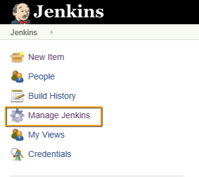
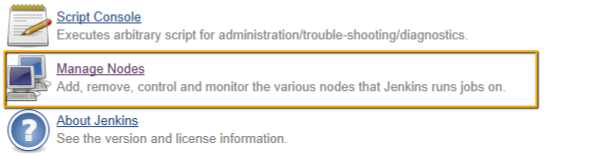
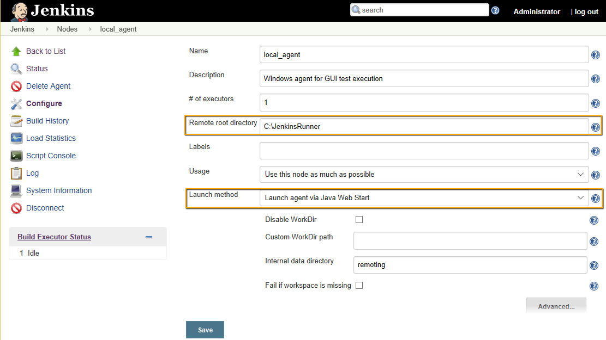

# rapise-jenkins-standalone

This project's intention is to demonstrate execution of Rapise GUI tests directly from Jenkins. 

Recommended approach is to use SpiraTest and RapiseLauncher designied for this task. In some cases it is not an option and we need to execute a test directly. That is what we are doing here.

# Preparing Jenkins Slave
Choose *Manage Jenkins*:

Select *Manage Nodes*:

Define a windows node:

It should be a Windows node. The PC owning this node must be windows host with Rapise installed. In general one or many remote nodes may be chosen. In particular the it may be the host running Jenkins itself (if it is a Windows host).

For the *Remote Root Directory* we choose fixed path `c:\JenkinsRunner`. It is because some parts of the test files rely on the fixed path. 

# Preparing Folder Structure
Test code may be stored either on the local folder or in Git. We use the following structure:

# Preparing Jenkins Project

