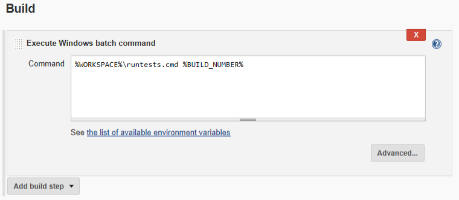

# Running Rapise GUI Tests with Jenkins

This project's intention is to demonstrate execution of [Rapise](https://www.inflectra.com/Rapise/) GUI tests directly from [Jenkins](https://jenkins.io/) CI tool. 

Recommended approach is to use [SpiraTest](https://www.inflectra.com/SpiraTest/) and RapiseLauncher designed for this task. In some cases it is not an option and we need to execute a test directly. That is what we are doing here.

# Preparing Jenkins Slave
Choose *Manage Jenkins*:


Select *Manage Nodes*:


Define a windows node:

The PC owning this node must be Windows host with Rapise installed. In general, one or many remote nodes may be chosen. In particular,  it may be the host running Jenkins itself (if it is a Windows host).

For the *Remote Root Directory* we choose fixed path `c:\JenkinsRunner`. It is because some parts of the test files rely on the fixed path. 

# Preparing Folder Structure
Test code may be stored either on the local folder or in Git. We use the fixed folder structure, so we may use absolute paths in the project configuration.


`workspace` sub-folder is created by Jenkins and all files are checked out into folder *<ProjectName>*:


*RapiseTest* is a project name we are going to create. 

*RapiseTest1* and *RapiseTest2* are sub-folders containing tests to be executed.

`runtests.bat` is file doing execution and collection of logs. It looks as follows:

```cmd
@set RUN_ROOT=%~dp0

@del /s/f/q %RUN_ROOT%RapiseTest1\Reports
@call %RUN_ROOT%\RapiseTest1\play.cmd
@echo ========== Output Log ==========
@type %RUN_ROOT%\RapiseTest1\last.tap

@del /s/f/q %RUN_ROOT%RapiseTest2\Reports
@call %RUN_ROOT%\RapiseTest2\play.cmd
@echo ========== Output Log ==========
@type %RUN_ROOT%\RapiseTest2\last.tap
```

This batch file executes 2 tests: `RapiseTest` and `RapiseTest2`.

If you want to execute more tests at once then this .bat may be expanded accordingly. 

We store `runtests.bat` in the Git repository. It may also be stored locally and referred by an absolute path.

Another approach for test execution is to make `runtests.bat` that executes only one test and make and configure Jenkins to have many Project each executing single test. In such case you may configure distributed parallel execution and achieve more fine-grained Jenkins execution status report, making it closer to what SpiraTest may do out of the box.

# Preparing Tests
Each test in Rapise has a file `play.cmd` stored in its folder. It is automatically generated when you play a test with Rapise.

Here is what we need to prepare:
1. Re-create final workspace structure, i.e. *Node root*/`workspace`/*ProjectName* and save the tests in it. 
2. Then open each test in Rapise and play it, so `play.cmd` contains correct absolute paths.
3. If needed, commit&push.

# Preparing Jenkins Project
We create new Jenkins project called `RapiseTest` and assign it to *local_agent* execution node created earlier:


Then configure Git (you may skip this if you have tests saved locally):


Then configure the Build step:


We refer to `runtests.cmd` starting from the project root. However, it may also be stored locally and referred by an absolute path.

Finally we may configure log parser. You need [Log Parser Plugin](https://wiki.jenkins.io/display/JENKINS/Log+Parser+Plugin) for Jenkins to enable it.


The log parser uses rules for the .tap format (we dump [TAP](https://testanything.org/) output to the console execution log in the `runtests.bat`).

You may also archive Rapise native execution report with your test using [HTML Publisher Plugin](https://wiki.jenkins.io/display/JENKINS/HTML+Publisher+Plugin). Files that need to be published are `**.trp`.

# Execution
Once `RapiseTest` project runs in Jenkins you should see GUI test execution on the Windows Slave host. Please, note that Slave should be executed on the unlocked desktop. See more info on remote execution [Here](https://www.inflectra.com/support/knowledgebase/kb131.aspx).

Log parser may provide information about failed assertions in your test. You may see them by accessing `Parsed Console Output` for the Build:


